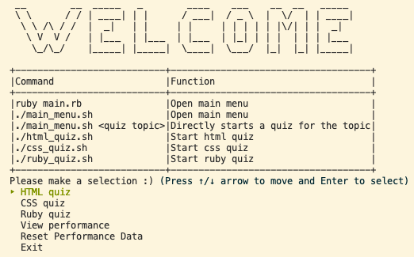
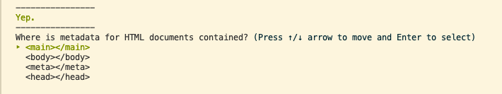
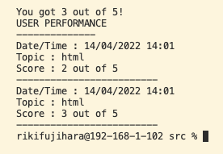
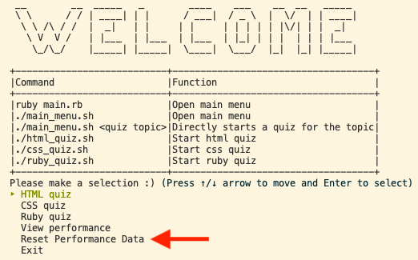
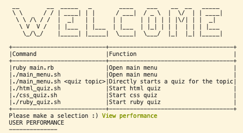

# Multiple Choice Quiz Command line application
Command line application by Riki Fujihara

# Application Features

## Displaying the quiz to the user

The most major feature of this application is displaying a selection of mupltiple choice quizzes to the user. The user can choose from different quizzes by either selecting from within the app itself or passing in command line arguments together with the executable scripts. There are also scripts that can be executed by themselves to directly choose a quiz without any additional arguments.

## Displaying quiz performance to the user
When the user has finished the quiz, the app displays the user's performance. The user will see all of their past results along with their current one, with their most recent results shown at the bottom.

## Resetting performance

The user can choose to reset all of their performance by making a selction from the main menu.

 

# Link to Source Control Repository

<a href="https://github.com/rikifujihara/quiz-app">Github - rikifujihara/quiz-app</a>

# Style Guide

This app's source code stying is mainly guided by Shopify's Ruby Style Guide which can be found <a href="https://ruby-style-guide.shopify.dev/#general">here</a>. Rubocop was used frequently which automatically styles the ruby code with best-practice conventions.

# Implementation Plan