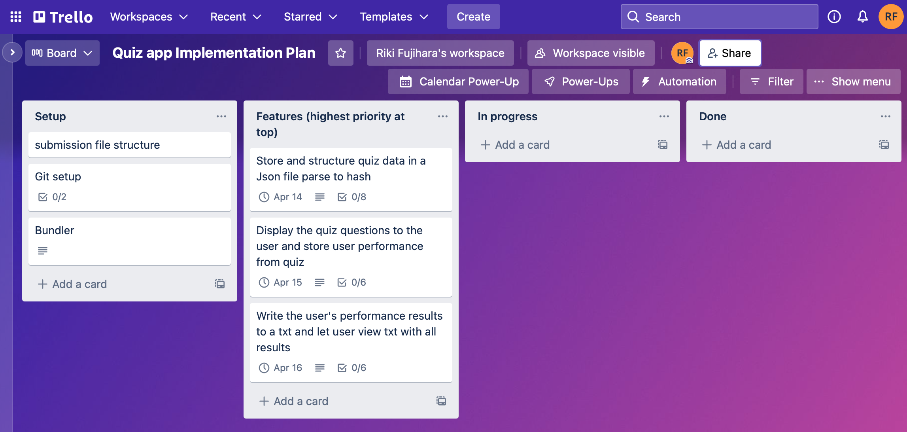
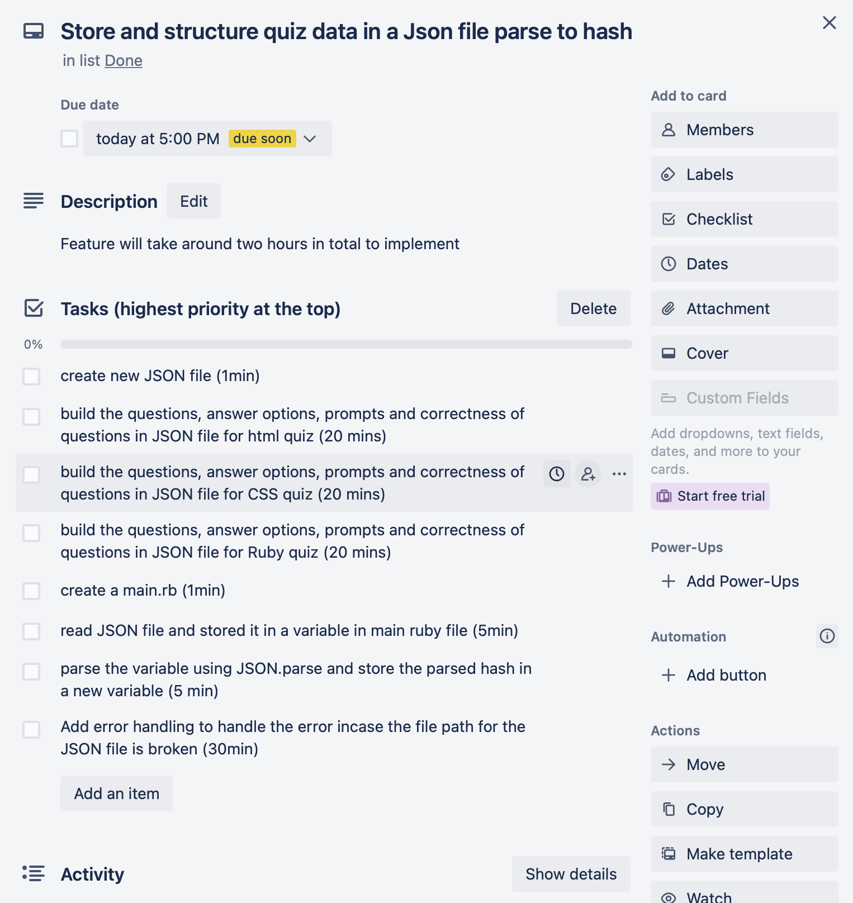
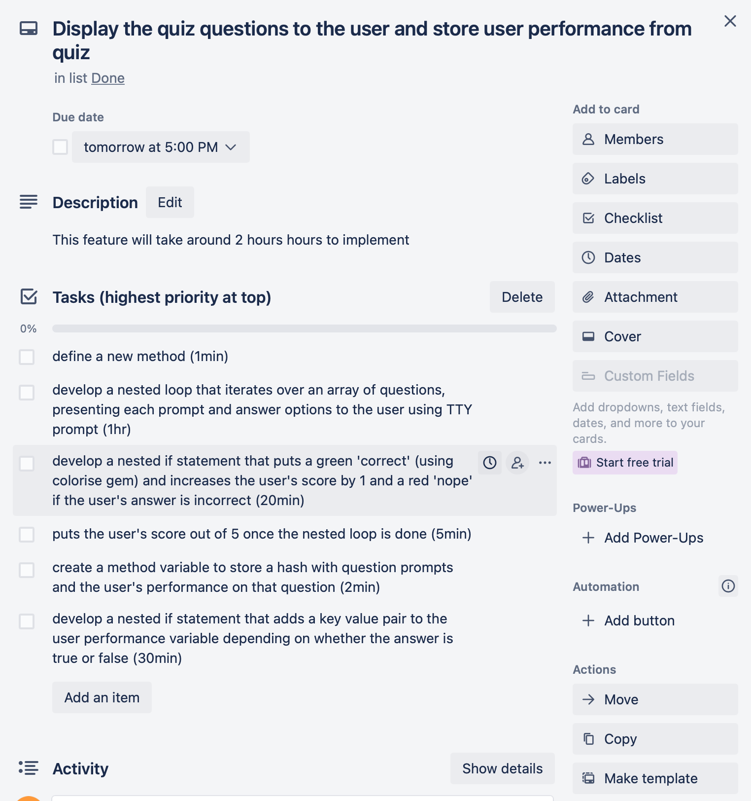
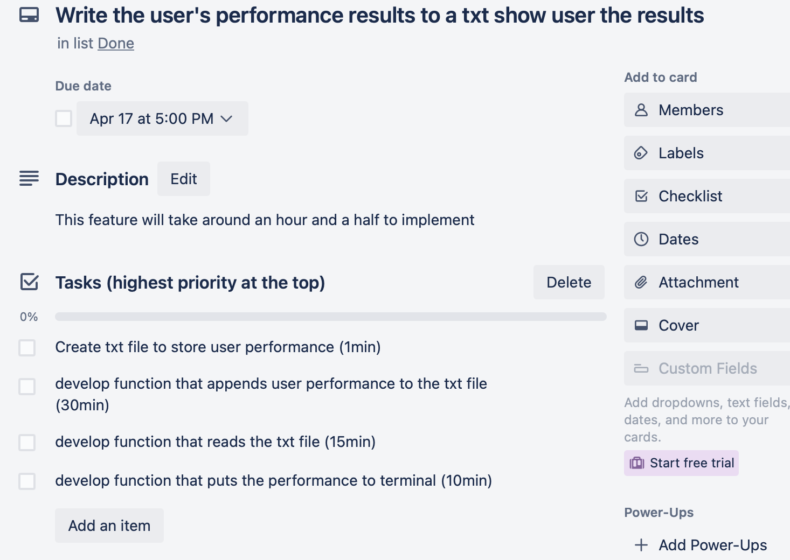
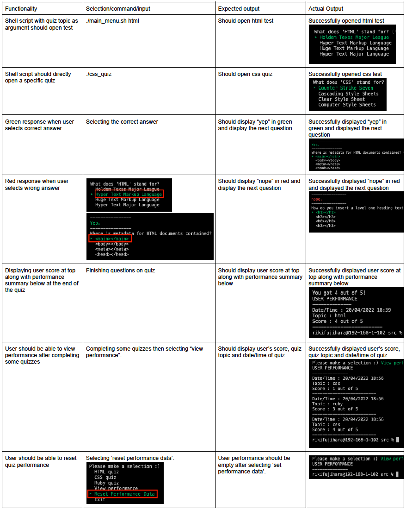
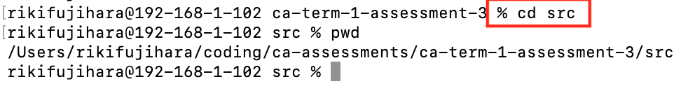
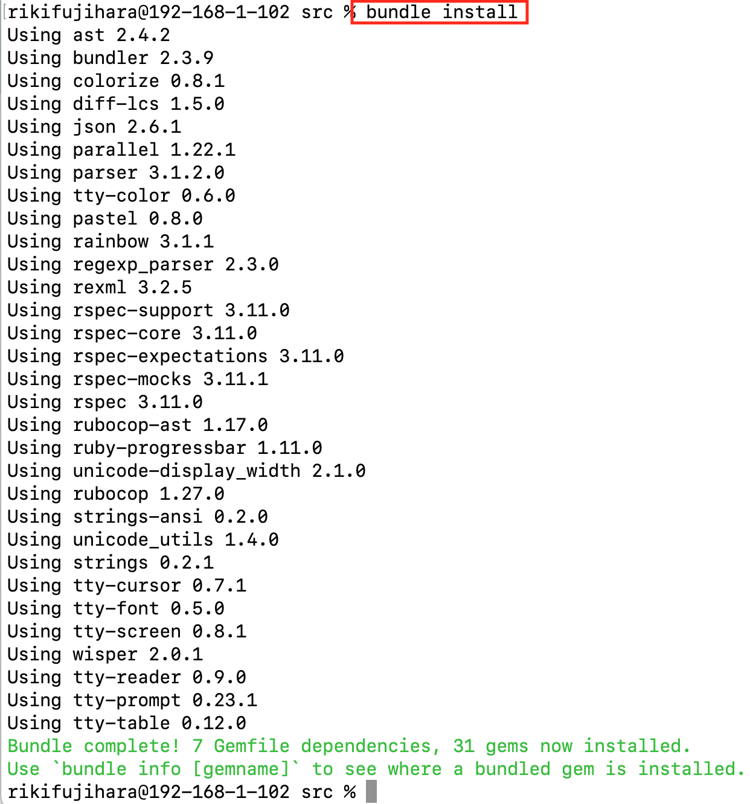
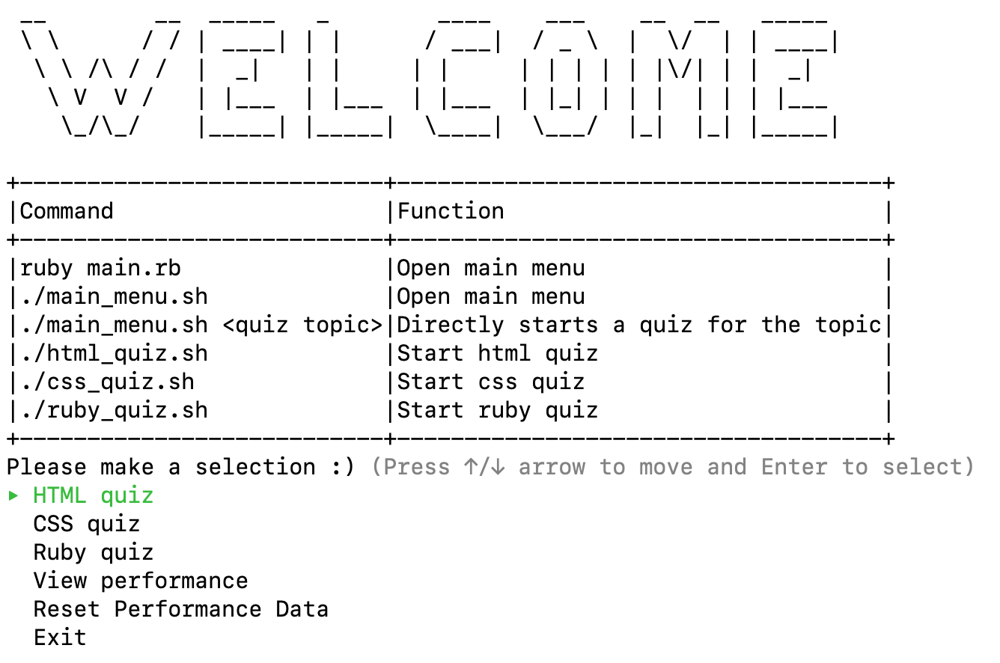

# Multiple Choice Quiz Command line application
Command line application by Riki Fujihara

# Application Features

## Displaying the quiz to the user

The most major feature of this application is displaying a selection of mupltiple choice quizzes to the user. The user can choose from different quizzes by either selecting from within the app itself or passing in command line arguments together with the executable scripts. There are also scripts that can be executed by themselves to directly choose a quiz without any additional arguments.

## Displaying quiz performance to the user
When the user has finished the quiz, the app displays the user's performance. The user will see all of their past results along with their current one, with their most recent results shown at the bottom.

## Resetting performance

The user can choose to reset all of their performance by making a selction from the main menu.

 

# Link to Source Control Repository

<a href="https://github.com/rikifujihara/quiz-app">Github - rikifujihara/quiz-app</a>

# Style Guide

This app's source code stying is mainly guided by Shopify's Ruby Style Guide which can be found <a href="https://ruby-style-guide.shopify.dev/#general">here</a>. Rubocop was used frequently to automatically style the ruby code with best-practice conventions.

# Implementation Plan

<a href='https://trello.com'>Trello</a> was used to plan the implementation of the features in the quiz app. The first step was to define the scope of the project and break down the development into smaller, sequential pieces of work with the highest priority items of the different tasks listed from top to bottom.

The link to the Trello board is <a href='https://trello.com/invite/b/K92qUPPe/f78335b4b1dafc82979fa57695897eb8/quiz-app-implementation-plan'>here</a>

## Each main feature was broken down into sequential tasks and split up into small actions with estimated durations (highest priority at the top).

I also used Trello to oversee the overall project, including making the development plan. I separated the work between tasks required to create the slide deck for the presentation, the actual code as well as this documentation. Project management software has been extremely helpful in ensuring all assessment criteria are satisfied and that I'm working specifically on tasks that move the project forward.

The link for the board below is <a href='https://trello.com/invite/b/iKyi1P1z/83301fcb00f59dcc871375370dd7a47a/ca-assessment-t1-assessment-3'>here</a>

# Testing

Both automated testing (RSpec) and manual testing was used to confirm that the application funtions as expected.

## RSpec
This automated test checks that the application's fundamental feature of incrementing the user's score is functioning as expected. The user's `score` should be incremented by `1` when the user answers a question correctly, and the `score` should not be incremented when the answer is incorrect.

## Manual testing procedure

# Installation Guide

## Dependencies

This terminal application was developed for Mac OS and will be compatible with most Mac OS versions. The Bundler gem will be required to install all dependencies - installation instructions for the Bundler gem can be found <a href='https://bundler.io'>here</a>.

All command line arguments and their functions are included in the main menu.

Gems used include:

- RSpec
- TTY Prompt
- TTY Prompt
- Colorize
- TTY Table
- Rubocop
- JSON

## Step 1: Download

- Download the and unpack the zip file

## Step 2: Change directory

Open the terminal app and `cd` into the `src` directory.

## Step 3: Install Bundler

To install bundler, run `gem install bundler`.

## Step 4: Use Bundler to install dependencies

Once the gem is installed, bundler can look at the gemfile in the `src` directory and download all of the application's dependencies.

To do this, run `bundle install`.

## Step 5: Open the Main Menu

You can do this by running either `ruby main.rb` or `./main_menu.sh`.

## Step 6: Try out some quizzes

Go ahead and test your coding knowledge - instructions for all command line arguments are visible in the main menu.

# Attribution

- This website showed me how to get the current date and time in Ruby <a href='https://www.tutorialspoint.com/ruby/ruby_date_time.htm'>here</a>

- TTY Prompt documentation <a href='https://github.com/piotrmurach/tty-prompt'>here</a>

- TTY Table documentation <a href ='https://github.com/piotrmurach/tty-table'>here</a>

- TTY Font documentation <a href ='https://github.com/piotrmurach/tty-font'>here</a>

- Colorize documentation <a href ='https://github.com/fazibear/colorize'>here</a>

- Rubocop documentation <a href ='https://github.com/rubocop/rubocop'>here</a>